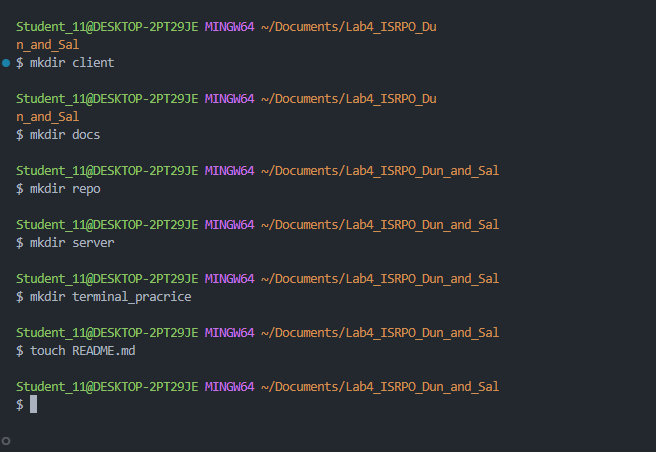
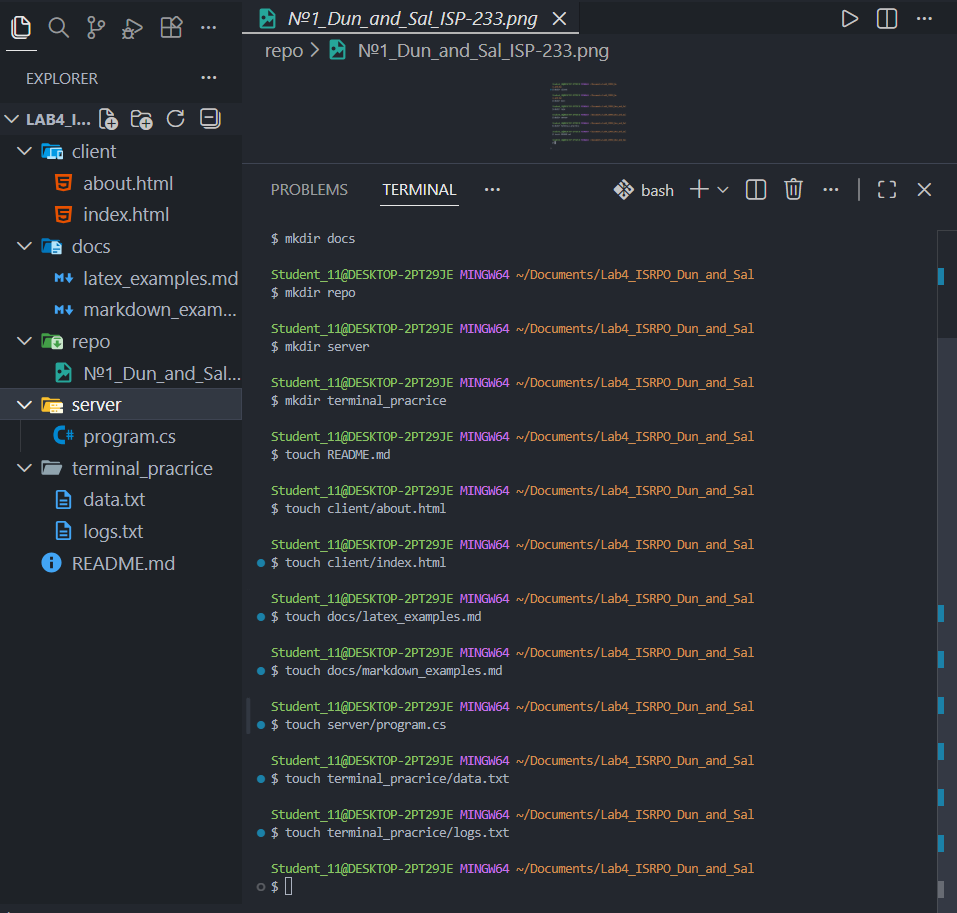

# Лабораторная работа №4
## Авторы
**ФИО:** Дунюшкин Никита Сергеевич / Салалыкина Олеся Максимовна
**Группа:** ИСП-233
**Дата:** 01.02.2026

## Описание проекта
Данный проект представляет собой учебное пособие по основам разметки текста с использованием **Markdown** и математической нотации **LaTeX**. Цель проекта — продемонстрировать основные возможности форматирования текста, создания структуры документа и оформления технической документации.

Проект включает:
- Примеры синтаксиса Markdown различных уровней сложности
- Математические формулы с использованием LaTeX
- Структурированную организацию файлов
- Визуальные примеры в виде скриншотов

## Содержание
- [Структура проекта](#структура-проекта)
- [Примеры форматирования](#примеры-markdown)
- [Математические формулы](#математические-формулы)
- [Скриншоты](#скриншоты-из-папки-repo)
- [Заключение](#заключение)

## Структура проекта


## Примеры Markdown

### Заголовки
``` # Заголовок ``` 
### Списки

#### Маркированный список

- Элемент 1
- Элемент 2
- Элемент 3

#### Нумерованный список

1. Первый пункт
2. Второй пункт
3. Третий пункт

### Картинка


### Блок кода

```bash
git status
git add .
git commit -m "..."
```

## Математические формулы

### Inline LaTeX

Теорема Пифагора: $a^2 + b^2 = c^2$

### Block LaTeX

$$
\sum_{i=1}^{n} i = \frac{n(n+1)}{2}
$$

## Ссылка на репозиторий

[Ссылка на репозиторий](https://github.com/Nadont02/Lab_4_Dun_and_Sal)

## Скриншоты из папки repo




## Заключение
В ходе выполнения данной лабораторной работы были изучены основные возможности языка разметки **Markdown** и системы подготовки документов **LaTeX**.