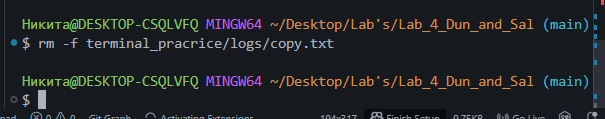

# Заголовок 1
---
**Жирный текст**

*Курсивный текст*

***Жирный курсив***

~~Зачёркнутый текст~~

`Моноширный текст` 
## Заголовок 2
***
- Элемент 1
- Элемент 2
- Элемент 3


* Пункт один
* Пункт два
* Пункт три

1. Первый шаг
2. Второй шаг
3. Третий шаг

- Основной элемент
  - Вложенный элемент 1
  - Вложенный элемент 2
    - Ещё более вложенный
- Ещё один основной элемент
  * Вложенный маркер
  * Ещё один
### Заголовок 3
___
> Пример цитаты  
> Вторая строка цитаты

```bash
git status
```
| Имя | Возраст | Город |
|-----|---------|-------|
| Иван | 25 | Москва |
| Мария | 30 | Санкт-Петербург |
| Алексей | 28 | Екатеринбург |
#### Заголовок 4
---


[Google](https://www.google.com)

[Перейти к заголовку](#заголовок-1)

- [x] Сделано
- [ ] Не сделано
- [x] Завершённый пункт
- [ ] В процессе
##### Заголовок 5
***
> [!NOTE]
> Это примечание для внимательных читателей.
###### Заголовок 6
___
$a^2 + b^2 = c^2$

$$
\sum_{i=1}^n i = \frac{n(n+1)}{2}
$$